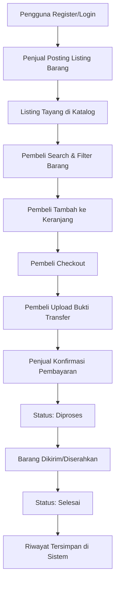
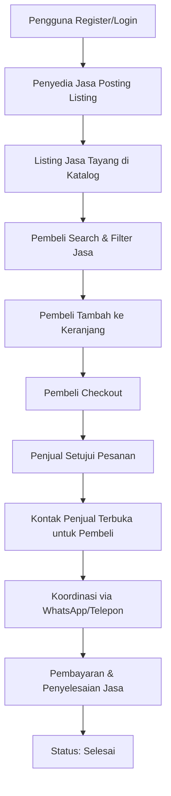
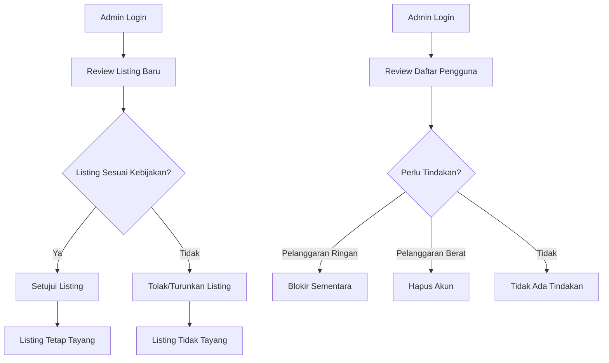

# Business Requirement Document (BRD)
# Buyorent

**Versi**: 1.0  
**Tanggal**: 6 Oktober 2026  
**Status**: Draft

---

## 1. Pendahuluan

### 1.1 Latar Belakang Masalah

Belakangan ini marak pelajar SMA sederajat yang berjualan melalui Facebook, WhatsApp, dan media sosial lainnya. Katalog yang dibuat biasanya berupa foto dan caption yang tersebar di story atau grup chat, sehingga tidak terstruktur, tidak memiliki fitur pencarian, dan jangkauannya hanya terbatas pada lingkaran pertemanan penjual.

Di sisi lain, banyak pelajar yang memiliki *skill* — seperti desain, fotografi, les privat, servis, dan sebagainya — yang berpotensi untuk diperjualbelikan, namun tidak memiliki wadah publikasi yang tepat.

### 1.2 Solusi yang Ditawarkan

Buyorent hadir sebagai solusi dengan menyatukan kedua hal tersebut dalam satu platform jual beli barang bekas sekaligus sewa jasa. Target pengguna utamanya adalah pelajar dan anak muda.

### 1.3 Manfaat yang Diharapkan

1. **Bagi Penjual**
   - Memiliki katalog yang terpusat dan terstruktur
   - Jangkauan pasar lebih luas melampaui lingkaran pertemanan
   - Rekam jejak transaksi yang membangun kredibilitas

2. **Bagi Pembeli**
   - Hemat waktu karena dapat mencari kebutuhan melalui search bar dan filter barang
   - Transaksi lebih aman dan terlacak
   - Akses lebih mudah ke penyedia jasa di sekitarnya

3. **Bagi Ekosistem**
   - Mendorong ekonomi sirkular melalui jual beli barang bekas
   - Memfasilitasi monetisasi skill dan jasa di kalangan pelajar

---

## 2. Analisis Situasi Saat Ini

### 2.1 Alur Bisnis Existing (Sebelum Buyorent)

| Langkah | Aktivitas | Keterbatasan |
|---------|-----------|--------------|
| **1. Persiapan Katalog** | Penjual membuat katalog manual (foto + caption) dan membagikan ke Facebook, WhatsApp, story, atau grup | Katalog tidak terstruktur, tidak ada pencarian/filter, sulit dikelola |
| **2. Pencarian Pembeli** | Calon pembeli melihat postingan atau ditawari teman, lalu menanyakan stok, kondisi, dan harga melalui chat | Komunikasi satu per satu, tidak efisien, jangkauan terbatas |
| **3. Negosiasi** | Kesepakatan harga dilakukan lewat chat | Tidak ada standar harga, rawan miskomunikasi |
| **4. Pembayaran** | Pembayaran dilakukan secara manual (transfer) | Tidak ada rekam transaksi resmi, rawan penipuan |
| **5. Pengiriman** | Barang diserahkan melalui COD atau pengiriman tanpa status transaksi yang jelas | Tidak ada tracking, tidak ada konfirmasi penyelesaian |
| **6. Sewa Jasa** | Jasa disewa atau dipakai berdasarkan informasi lisan | Tidak ada rekam jejak penjual maupun penyedia jasa |

### 2.2 Masalah Utama yang Dihadapi

1. **Struktur Katalog**
   - Tidak terpusat, tersebar di berbagai platform
   - Tidak ada fitur pencarian atau filter
   - Sulit untuk di-update dan dikelola

2. **Jangkauan Pasar**
   - Terbatas pada lingkaran pertemanan penjual
   - Tidak ada eksposur ke pembeli potensial di luar jaringan

3. **Keamanan Transaksi**
   - Transaksi tidak terlacak dan rawan penipuan
   - Tidak ada rekam jejak yang membangun kredibilitas penjual
   - Tidak ada mekanisme penyelesaian sengketa

4. **Inefisiensi Operasional**
   - Waktu yang terbuang untuk komunikasi satu per satu
   - Tidak ada sistem yang menstandardisasi proses jual beli
   - Sulit melacak status pesanan

---

## 3. Ruang Lingkup Bisnis

### 3.1 Cakupan Inisiatif

**DALAM RUANG LINGKUP:**
The following business processes will be supported by Buyorent:

1. **Registrasi dan Autentikasi Pengguna**
   - Pendaftaran akun dengan email dan password
   - Login untuk akses ke platform

2. **Manajemen Katalog**
   - Penjual dapat membuat, mengedit, dan menghapus listing barang/jasa
   - Katalog terpusat dengan struktur data konsisten

3. **Pencarian dan Discovery**
   - Pembeli dapat mencari item berdasarkan kata kunci
   - Filter berdasarkan kategori dan rentang harga

4. **Proses Transaksi**
   - Keranjang belanja untuk koleksi item
   - Checkout dengan pengumpulan data pengiriman/kontak
   - Mekanisme pembayaran manual dengan bukti transfer

5. **Tracking Pesanan**
   - Riwayat pesanan untuk pembeli dan penjual
   - Status pesanan yang dapat dipantau (Menunggu Pembayaran → Diproses → Selesai)

6. **Moderasi Konten**
   - Admin dapat memoderasi listing yang melanggar kebijakan
   - Admin dapat mengelola akun pengguna

**DI LUAR RUANG LINGKUP:**
The following are explicitly out of scope for the current phase:

1. **Payment Gateway Terintegrasi**
   - Integrasi dengan bank atau payment provider (akan di tahap berikutnya)

2. **Sistem Rating dan Review**
   - Fitur rating, review, dan reputasi penjual (akan di tahap berikutnya)

3. **Live Chat Internal**
   - Komunikasi real-time antara pembeli dan penjual di dalam platform (akan di tahap berikutnya)

4. **Notifikasi Otomatis**
   - Email atau push notification untuk update status (akan di tahap berikutnya)

### 3.2 Stakeholder Bisnis

| Stakeholder | Peran | Kepentingan |
|-------------|-------|-------------|
| **Pelajar/Penjual** | Penyedia barang/jasa, pencari penghasilan tambahan | Platform yang mudah digunakan, jangkauan pasar luas, transaksi aman |
| **Pelajar/Pembeli** | Konsumen barang bekas, pengguna jasa | Harga terjangkau, kualitas terjamin, proses transaksi mudah |
| **Admin Platform** | Moderator, pengelola platform | Kontrol konten, kelola pengguna, maintain platform |
| **Sponsor/Investor** | Penyedia dana, pemangku kepentingan | ROI, pertumbuhan pengguna, keberlanjutan platform |

---

## 4. Alur Bisnis yang Diinginkan (To-Be Process)

### 4.1 Alur Utama: Jual Beli Barang Bekas

### 4.2 Alur Khusus: Sewa Jasa

### 4.3 Proses Admin dan Moderasi

---

## 5. Persyaratan Bisnis

### 5.1 Persyaratan Fungsional (High-Level)

| ID | Persyaratan | Prioritas | Keterangan |
|----|-------------|-----------|------------|
| BR-001 | Pengguna dapat mendaftar dengan email dan password | High | Tanpa verifikasi email |
| BR-002 | Pengguna dapat login dengan kredensial yang valid | High | Session management aman |
| BR-003 | Pengguna dapat membuat listing barang/jasa | High | Dengan foto, deskripsi, harga, kategori |
| BR-004 | Pengguna dapat mencari listing berdasarkan kata kunci | High | Search bar dengan real-time suggestion |
| BR-005 | Pengguna dapat memfilter listing berdasarkan kategori dan harga | High | Kombinasi filter available |
| BR-006 | Pembeli dapat menambahkan item ke keranjang | High | Keranjang persistent per user |
| BR-007 | Pembeli dapat checkout item di keranjang | High | Kumpulkan data pengiriman/kontak |
| BR-008 | Pembeli dapat mengunggah bukti transfer | Medium | Untuk konfirmasi pembayaran manual |
| BR-009 | Penjual dapat mengonfirmasi pembayaran | Medium | Ubah status pesanan |
| BR-010 | Pengguna dapat melihat riwayat pesanan | Medium | Untuk pembeli dan penjual |
| BR-011 | Admin dapat memoderasi listing | High | Setujui/tolak/turunkan |
| BR-012 | Admin dapat mengelola pengguna | Medium | Lihat, blokir, hapus akun |

### 5.2 Persyaratan Non-Fungsional

| ID | Persyaratan | Metrik | Keterangan |
|----|-------------|--------|------------|
| NFR-001 | Ketersediaan Platform | Uptime > 95% | Platform harus tersedia saat dibutuhkan |
| NFR-002 | Performa Pencarian | Response time < 2 detik | Search dan filter harus cepat |
| NFR-003 | Keamanan Data | Password di-hash, session aman | Mengikuti best practice security |
| NFR-004 | Usability | Responsive di desktop & mobile | Interface mudah digunakan oleh target pengguna |
| NFR-005 | Skalabilitas | Support hingga 1000 pengguna aktif | Arsitektur harus scalable untuk growth |

### 5.3 Asumsi Bisnis

1. **Asumsi Pengguna**
   - Pengguna memiliki akses ke smartphone dan internet
   - Pengguna memiliki rekening bank untuk transfer manual
   - Pengguna memiliki nomor WhatsApp/telepon untuk koordinasi

2. **Asumsi Operasional**
   - Admin tersedia untuk moderasi konten secara manual
   - Tidak ada auto-moderation pada tahap awal
   - Platform dihosting dengan biaya yang terjangkau

3. **Asumsi Pasar**
   - Ada permintaan untuk platform jual beli barang bekas di kalangan pelajar
   - Ada permintaan untuk platform sewa jasa di kalangan pelajar
   - Pengguna bersedia menggunakan platform baru jika memberikan nilai tambah

---

## 6. Analisis Risiko

| Risiko | Dampak | Probabilitas | Mitigasi |
|--------|--------|--------------|----------|
| **Adopsi Rendah** | Platform tidak digunakan oleh target pengguna | Medium | Marketing ke komunitas pelajar, partnership dengan sekolah |
| **Penipuan** | Transaksi penipuan merusak reputasi platform | High | Sistem moderasi admin, rekam jejak transaksi, mekanisme report |
| **Keterbatasan Fitur** | Platform kurang kompetitif dibanding alternatif | Low | Fokus pada MVP, iterasi cepat berdasarkan feedback |
| **Ketergantungan Teknis** | Masalah teknis mengganggu operasional | Medium | Monitoring uptime, backup plan, responsive support |
| **Regulasi** | Isu legal terkait perdagangan online | Low | Konsultasi hukum sederhana, terms of service jelas |

---

## 7. Kriteria Sukses Bisnis

### 7.1 Key Performance Indicators (KPIs)

| KPI | Target (Bulan 1) | Target (Bulan 3) | Pengukuran |
|-----|------------------|------------------|------------|
| **Jumlah Pengguna Terdaftar** | 50 | 200 | Dashboard admin |
| **Jumlah Listing Aktif** | 30 | 100 | Database count |
| **Transaksi Berhasil** | 10 | 50 | Order completed status |
| **Retention Rate** | 40% | 60% | Users active dalam 30 hari |
| **Customer Satisfaction** | N/A | Survey rating 4/5 | User feedback form |

### 7.2 Return on Investment (ROI) Considerations

**Investasi Awal:**
- Development cost (time & resources)
- Hosting & infrastructure
- Maintenance & support

**Manfaat Jangka Panjang:**
- Platform sebagai asset digital
- Data pengguna dan transaksi untuk analisis
- Potensi monetization (commission fees di tahap berikutnya)
- Social impact: pemberdayaan ekonomi pelajar

---

## 8. Timeline dan Milestone

| Fase | Aktivitas Utama | Durasi | Deliverable |
|------|-----------------|--------|-------------|
| **Fase 1: Development** | Implementasi MVP berdasarkan PRD | 4-6 minggu | Platform live dengan fitur dasar |
| **Fase 2: Pilot Testing** | Testing dengan kelompok kecil pengguna | 2 minggu | Feedback report, bug fixes |
| **Fase 3: Launch** | Launch ke publik dengan marketing minimal | 1 minggu | Platform publicly available |
| **Fase 4: Iteration** | Collect feedback, prioritize enhancements | Ongoing | Updated roadmap |

---

## 9. Persetujuan

**Disetujui oleh:**

| Nama | Peran | Tanggal |
|------|-------|---------|
| Muhamad Jundi Al Hafidz | Project Lead & Full Stack Developer | 29 September 2026 |
| Zariel Waleed Hidayat | UI/UX Designer & Frontend Developer | 29 September 2026 |
| Fauzunnajah Attamam | Backend Developer | 29 September 2026 |
| Sultan Doven Hagi | Database Developer | 29 September 2026 |
| Muhammad Salim Umar | Developer OPS | 29 September 2026 |
| Wildan Haibatur Rohim | Assistant UI/UX Designer | 29 September 2026 |

**Untuk pertanyaan atau klarifikasi**, hubungi business analyst atau project lead.

---

*Dokumen ini merupakan dasar untuk pengembangan solusi teknis dan harus direferensikan dalam semua diskusi pengembangan selanjutnya.*
